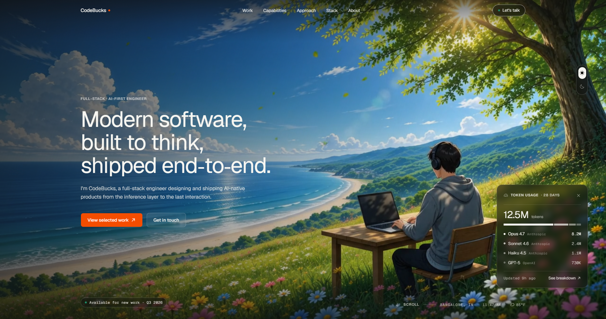
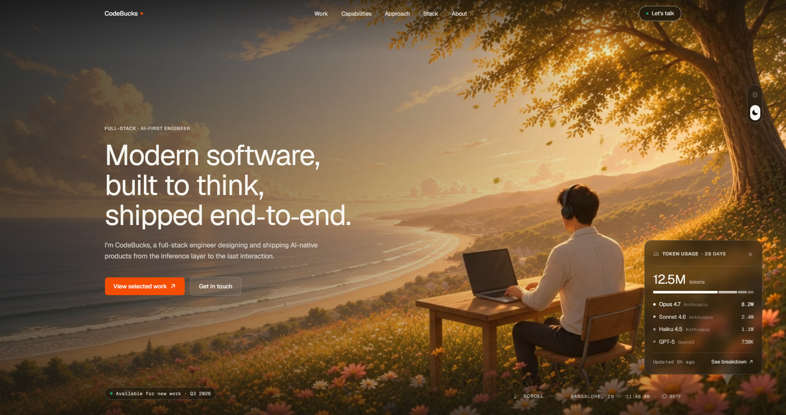
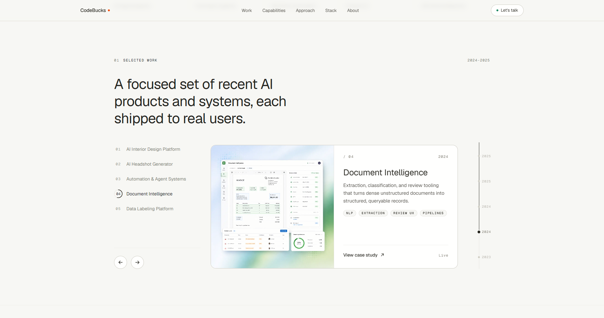
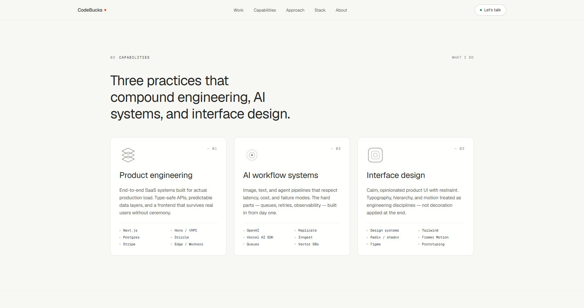
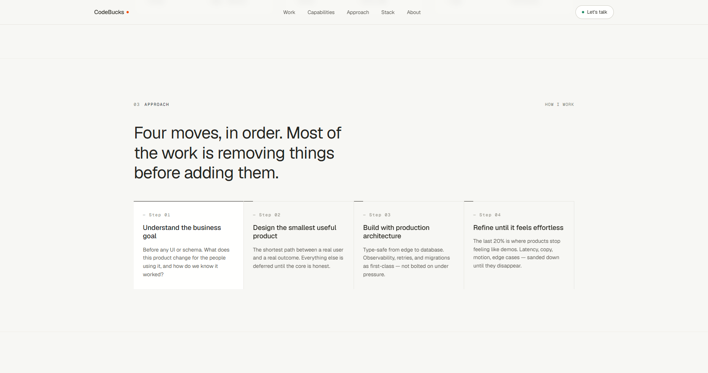
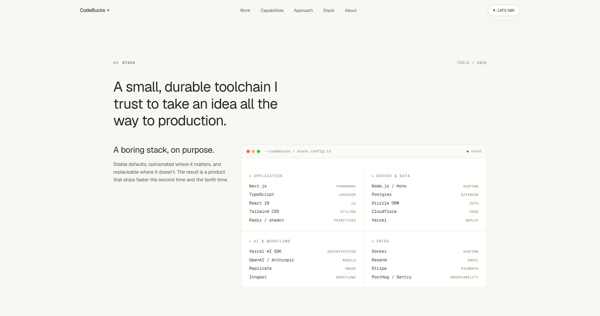
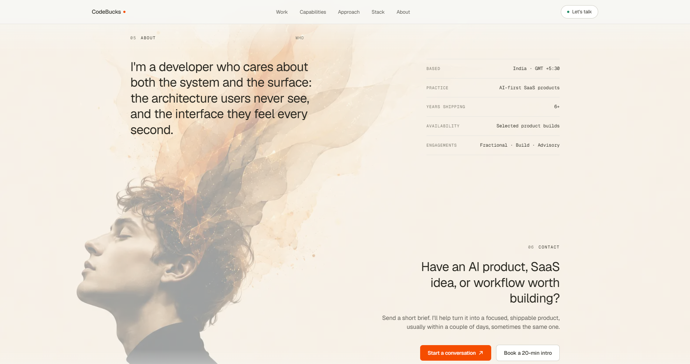
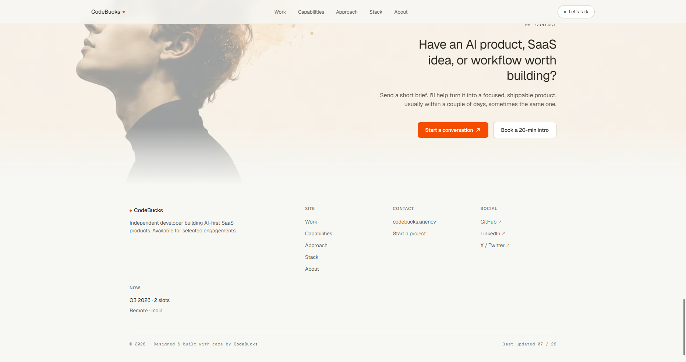

# Modern Developer Portfolio

**A sleek, editorial-style developer portfolio built with Next.js 16, Tailwind v4, and Motion.** Warm cream canvas, hairline depth, light-weight display type — and a signature day/night hero that swaps a live background video with smooth choreography.




> 🎉 **Thank you for your purchase!** You're holding the complete, production-ready source code. This README walks you from an empty folder to a live site — even if you've never touched Next.js before. Take your time; every step is spelled out.

> 📺 Prefer to follow along? The full build is on YouTube → **[Watch the tutorial](https://youtu.be/1qJEZVr6eXE)**

---

## ✨ Features

- 🌗 **Interactive day/night switch in the hero** — the signature feature. A single toggle swaps a *day* background video for a *night* one, with choreographed transitions across the whole hero.
- 📍 **Live visitor location + real-time weather widget** — server-side geolocation and live weather, with **zero API keys**. It just works.
- 📊 **AI token-usage widget** — an animated stat card that brings numbers to life.
- 🎨 **Editorial "magazine-style" design system** — warm cream canvas, hairline borders instead of drop shadows, light-weight display type with negative tracking, and a single restrained orange accent.
- 🖼️ **Selected Work** — an animated project carousel.
- 🧩 **Capabilities** — a section powered by hand-crafted, animated icons.
- 🪜 **Approach / process**, a faux code-editor **Stack** section, plus **About** and **Contact**.
- 🧭 **Scroll-aware header** — a mobile menu and a smooth overlay → solid transition on scroll, with a footer to match.
- 🎬 **Choreographed scroll reveals** via a reusable `Reveal` component, with full `prefers-reduced-motion` support.
- 📱 **Fully responsive** and **content-centralized** — nearly all copy lives in one file, so customizing is mostly editing text.
- ▲ **Deploys to Vercel with zero config** — the location + weather widget goes live automatically once deployed.

---

## 🧱 Tech Stack

| Layer | Technology |
|---|---|
| Framework | **Next.js 16** (App Router · Turbopack) |
| UI library | **React 19** |
| Language | **TypeScript** |
| Styling | **Tailwind CSS v4** (CSS-first config) |
| Components | **shadcn/ui** |
| Animation | **Motion** (Framer Motion) via `motion/react` |
| Icons | **@phosphor-icons/react** |
| Theming | **next-themes** |
| Fonts | **Geist** + **Geist Mono** |
| Weather API | **Open-Meteo** (free · keyless) |
| Geolocation | **Vercel geo headers** in prod · **ipapi.co** fallback in dev |
| Package manager | **Bun** (npm / pnpm / yarn also work) |

> 🔑 **No API keys, no `.env` file, nothing to sign up for.** The weather and location features run entirely on free, keyless services.

---

## 📁 Project Structure

```
modern-portfolio/
├─ app/                  # App Router: pages, layout.tsx, globals.css (design tokens)
├─ components/           # Portfolio sections (hero, selected-work, capabilities…)
│  ├─ ui/                # shadcn/ui primitives
│  └─ widgets/           # Location + weather and token-usage widgets
├─ lib/
│  ├─ content.ts         # ⭐ All site copy, projects, and links — your main edit point
│  ├─ weather.ts         # Open-Meteo weather fetching
│  └─ location.ts        # Server geolocation (Vercel headers + ipapi.co fallback)
├─ public/assets/        # Hero videos, posters, and project images
└─ project-images/       # Screenshots used in this README
```

> 💡 **The one file to remember:** `lib/content.ts`. It holds your nav, projects, capabilities, stack, and footer links. Editing it is how you make the site yours.

---

## 🚀 Getting Started

New to all this? No problem. Follow the steps in order.

### 1. Accept your GitHub invitation

After purchase, an invitation to this **private repository** is sent to the GitHub account tied to your checkout email.

1. Check your email for a message from **GitHub** (subject line mentions being invited to a repository). Also check the **Notifications** bell on [github.com](https://github.com).
2. Click **View invitation**, then **Accept invitation**.
3. You now have full access to this repo. 🎉

> ℹ️ Don't have a GitHub account yet? Create a free one at [github.com/signup](https://github.com/signup) using the **same email** you paid with, then look for the invite.

### 2. Get the code onto your computer

Pick whichever feels comfortable — both give you the same files.

<details>
<summary><strong>🟢 Option A — Download as a ZIP (easiest, no tools)</strong></summary>

1. On the repository page, click the green **`< > Code`** button.
2. Choose **Download ZIP**.
3. Unzip the folder somewhere you'll find it (e.g. your Desktop).

</details>

<details>
<summary><strong>🔵 Option B — Clone with Git (recommended if you'll update later)</strong></summary>

```bash
git clone https://github.com/codebucks27/Nextjs-Developer-Portfolio.git
cd Nextjs-Developer-Portfolio
```

</details>

### 3. Install a package manager

You need **Node.js 20.9+** (or **Bun 1.2+**). If you're not sure what you have, install one of these:

- **Node.js** (works with npm, pnpm, yarn) → [nodejs.org](https://nodejs.org) — grab the **LTS** version.
- **Bun** (fastest, recommended) → [bun.sh](https://bun.sh).

### 4. Install dependencies

Open a terminal **inside the project folder**, then run the command for your package manager:

<details open>
<summary><strong>Bun (recommended)</strong></summary>

```bash
bun install
```

</details>

<details>
<summary><strong>npm / pnpm / yarn</strong></summary>

```bash
# npm
npm install

# pnpm
pnpm install

# yarn
yarn
```

</details>

### 5. Start the dev server

```bash
bun dev        # or: npm run dev / pnpm dev / yarn dev
```

Then open **[http://localhost:3000](http://localhost:3000)** in your browser. You should see your portfolio running live. Edits save and refresh instantly. ✨

### 6. Build for production

When you're ready to ship:

```bash
bun run build    # or: npm run build
bun run start    # or: npm run start  — serve the production build locally
```

---

## 🎨 Make It Yours

Almost everything is designed to be edited without hunting through code.

| What you want to change | Where to do it |
|---|---|
| ✍️ **Copy, projects, links** (nav, work, capabilities, stack, footer) | `lib/content.ts` — one central file |
| 🖼️ **Hero videos, posters, project images** | Swap files in `public/assets/` (keep the same filenames, or update the paths in `content.ts`) |
| 🎨 **Colors, fonts, spacing** (design tokens) | `app/globals.css` — the `@theme` block |
| 🧾 **Site metadata** (title, description, social preview) | `app/layout.tsx` |

**Tips:**

> 🎥 To change the day/night hero backgrounds, replace `hero-background-video.mp4` / `hero-night-video.mp4` and their `hero-day-poster.webp` / `hero-night-poster.webp` posters in `public/assets/`. Keep videos lean (short, compressed) for fast loads.

> 🎨 The design system is token-driven. Change one value in `app/globals.css` (like the orange accent or the cream canvas) and it flows through the entire site — no find-and-replace needed.

> ✅ After any change, it's worth running `bun run typecheck` — TypeScript will flag typos in content or props before you even open the browser.

---

## ▲ Deploy to Vercel

The site is built for **zero-config deployment**.

1. Push your copy to your own GitHub repository (or import the folder directly).
2. Go to [vercel.com/new](https://vercel.com/new) and **import** the repository.
3. Click **Deploy** no environment variables to set.

That's it. Once deployed, the **live location + weather widget** starts working automatically, because Vercel provides the geolocation headers in production. 🌍

---

## 🛠️ Troubleshooting

<details>
<summary><strong>"Node version" or engine errors on install</strong></summary>

You need **Node.js 20.9 or newer** (or Bun 1.2+). Check your version with `node -v`. If it's older, install the latest **LTS** from [nodejs.org](https://nodejs.org) and try again.

</details>

<details>
<summary><strong>Port 3000 is already in use</strong></summary>

Another app is using the port. Either stop that app, or run the dev server on a different port:

```bash
bun dev --port 3001        # or: npm run dev -- --port 3001
```

Then open `http://localhost:3001`.

</details>

<details>
<summary><strong>Something feels off after switching package managers</strong></summary>

Stick to one package manager per project. If you started with npm and switched to Bun (or vice versa), delete `node_modules` and the other lockfile, then reinstall. When in doubt, use **`bun dev`** — the project is tuned for Bun.

</details>

<details>
<summary><strong>The weather / location widget shows nothing in local dev</strong></summary>

Locally it uses the free ipapi.co fallback, which can occasionally rate-limit. This resolves itself, and in production on Vercel it uses Vercel's own geo headers — reliably and instantly.

</details>

---

## 📜 Scripts

| Command | What it does |
|---|---|
| `bun dev` | Start the local dev server (Turbopack) |
| `bun run build` | Create an optimized production build |
| `bun run start` | Serve the production build locally |
| `bun run lint` | Run ESLint |
| `bun run format` | Format files with Prettier |
| `bun run typecheck` | Type-check with `tsc --noEmit` |

> Using npm/pnpm/yarn? Swap `bun` for `npm run` / `pnpm` / `yarn` (e.g. `npm run dev`).

---

## 💬 Support & Contact

Questions, or want a fully custom build?

- ✉️ Email — [codebucks27@gmail.com](mailto:codebucks27@gmail.com)
- 📺 YouTube — [youtube.com/codebucks](https://www.youtube.com/codebucks)
- 🐦 X / Twitter — [@code_bucks](https://twitter.com/code_bucks)
- 🌐 Website — [devdreaming.com](https://devdreaming.com)
- 🧩 **Need a custom website?** [Start a project →](https://tally.so/r/wdlj0N)

---

## 📸 More Screenshots

### 🌙 Hero — Night mode


### 🗂️ Selected Work


### 🧩 Capabilities


### 🪜 Approach


### 💻 Stack


### ✉️ Contact


### 🔻 Footer


---

## 🔒 License & Fair Use

This is **paid, licensed source code**, and access is granted **per purchase** through a GitHub invitation to this private repository.

**✅ You may:**
- Use it for your **own** personal or commercial portfolio.
- Modify it freely change the design, content, and code however you like.
- Deploy your customized version anywhere.

**🚫 You may not:**
- Share, resell, or redistribute the source code.
- Publish it publicly — including public forks, public repositories, or gists.
- Leak or hand off the code to anyone who hasn't purchased their own license.

In short: **build amazing things with it, just keep the source private to you.** One purchase, one licensed user. 💛

> 🙏 **Thank you for supporting the channel.** Your purchase directly funds more free tutorials and open projects. It genuinely means a lot. Now go build something beautiful. - **CodeBucks**
